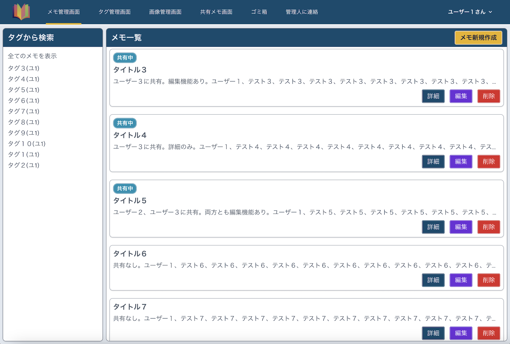
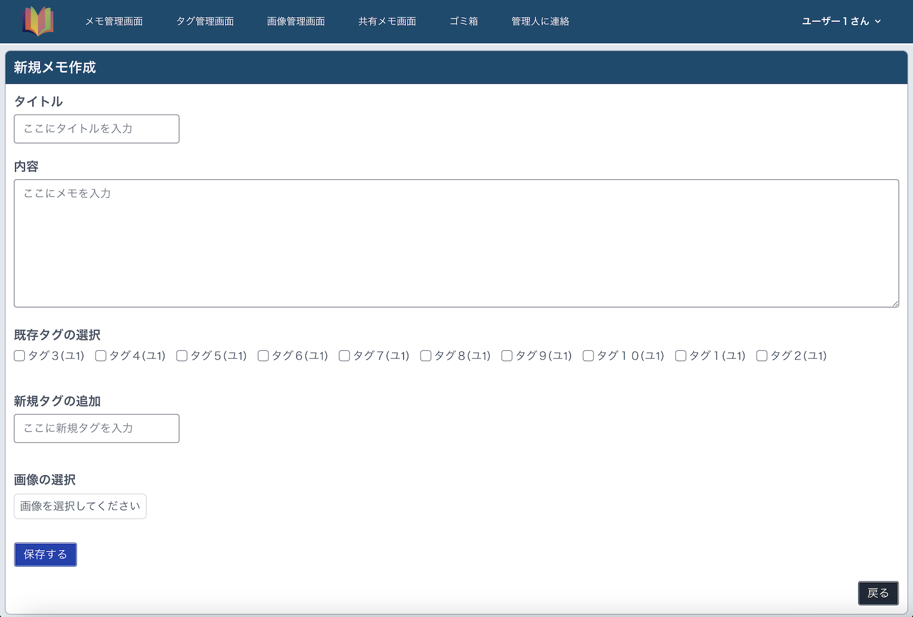
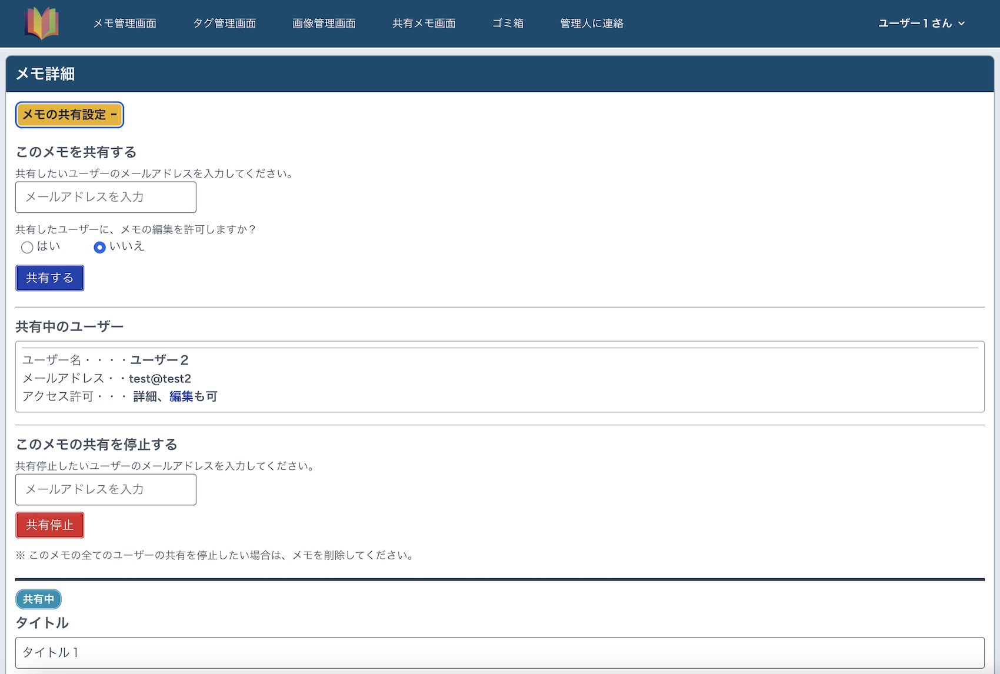
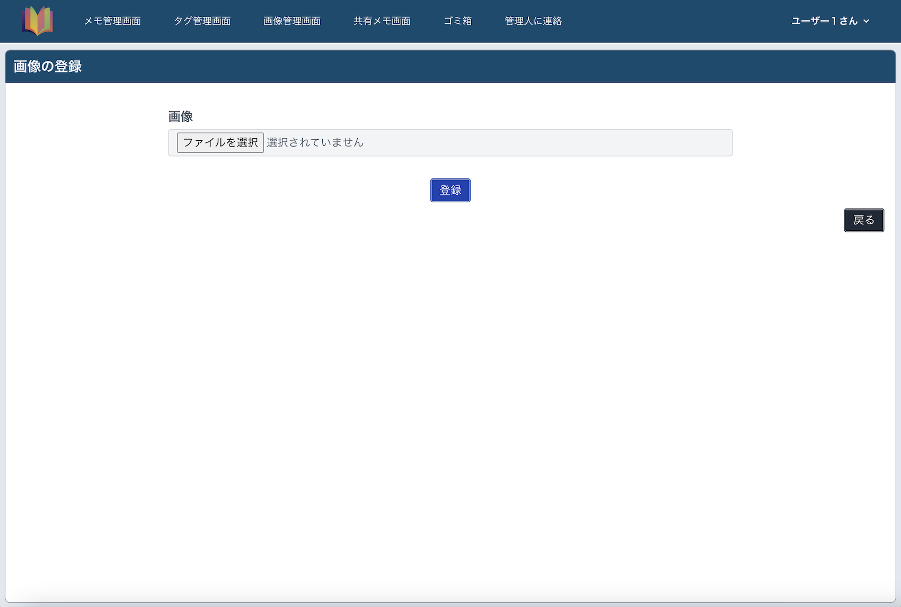
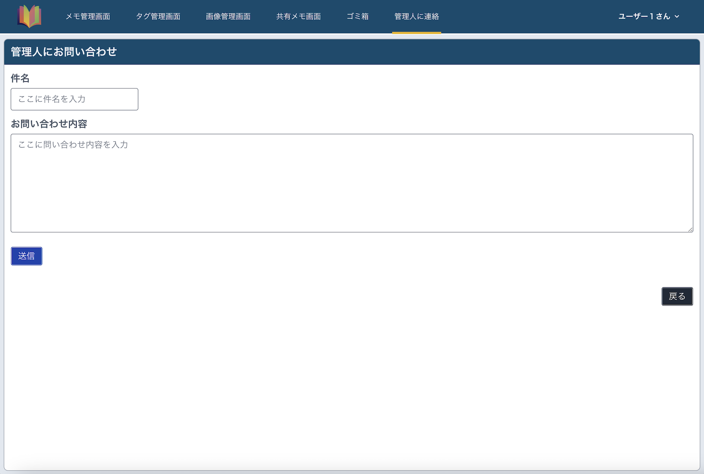
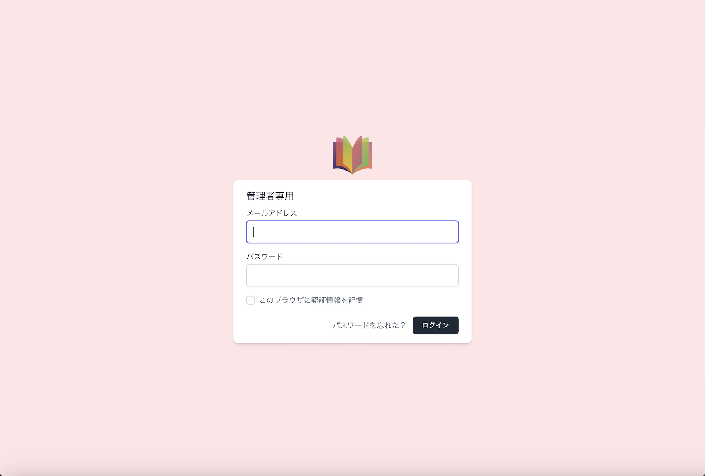
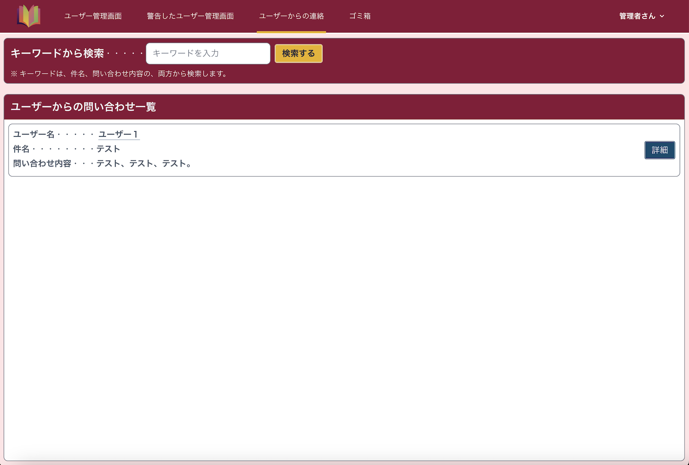
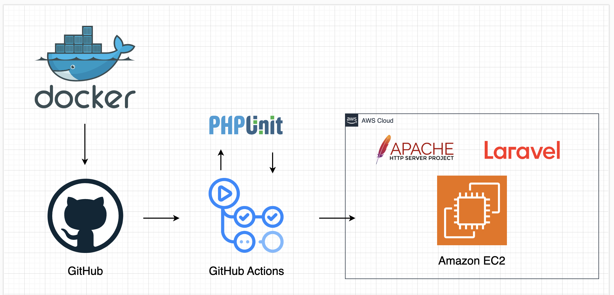

# EasyMemo

# サービスURL

https://portfoliomy-memo-app.click

# 機能一覧

| ログイン画面（ユーザー用）                                                                                   | 　メモ一覧画面（ユーザー用）                                           |
|-------------------------------------------------------------------------------------------------|----------------------------------------------------------|
|                                                     |                |
| ユーザー専用のログイン画面です。 ログインIDとパスワードを入力することでログイン可能になっています。新規ユーザー登録、パスワードリセット画面にページ移動できるようになっています。 | 保存されたメモの一覧から、詳細、編集、削除ができるようになっています。タグからメモの絞り込む機能を実装しました。 |

| 新規メモ作成画面（ユーザー用）                                   | 　新規メモ作成の画像の選択画面（ユーザー用）                                      |
|---------------------------------------------------|-------------------------------------------------------------|
|    |  |
| タイトル、内容、新規または登録済みのタグ、登録済み画像を、メモに付け登録ができるようにしています。 | 新規メモ作成画面の、画像選択ボタンをクリックすることで、モーダルが開き、登録済みの画像を選択できるように実装しました。 |

| メモの詳細画面（ユーザー用）                               | 　メモの共有設定画面（ユーザー用）                                                   |
|----------------------------------------------|---------------------------------------------------------------------|
|  |               |
| 登録したメモの詳細を表示することができるようになっています。            　　 | メモ詳細画面の、メモ共有設定ボタンをクリックすることで、アコーディオンが開き、メモの共有設定、共有状態を確認できるように実装しました。 |

| 画像一覧画面（ユーザー用）                                   | 　新規画像登録画面（ユーザー用）                                       |
|-------------------------------------------------|--------------------------------------------------------|
|  |       |
| メモで選択できる画像一覧、画像をクリックすると、画像の詳細、削除ができるようになっています。  | 画像の一覧画面の、画像新規登録ボタンをクリックすることで、画像をリサイズして登録ができるように実装しました。 |

| タグ管理画面（ユーザー用）                              | 　管理人への問い合わせ画面（ユーザー用）                                 |
|--------------------------------------------|------------------------------------------------------|
|  |  |
| メモで選択できるタグの一覧、新規作成、一括削除ができるようになっています。      | 管理人者に連絡が取れるようになっています。                                |

| 共有メモ一覧画面（ユーザー用）                                                   | 　共有メモ編集画面（ユーザー用）                                    |
|-------------------------------------------------------------------|-----------------------------------------------------|
|               |  |
| 自分に共有されているメモ一覧から、詳細、編集ができるようになっています。ユーザー名から共有メモの絞り込みできるように実装しました。 | 共有メモの編集が許可されている場合は、編集（内容のみ）できるように実装しました。            |

| ログイン画面（管理者用）                                                                                 | 　ユーザー　一覧画面（管理者用）                                               |
|----------------------------------------------------------------------------------------------|----------------------------------------------------------------|
|                                                  |                |
| 管理者専用のログイン画面です。 登録されているログインIDとパスワードを入力することでログイン可能になっています。パスワードリセット画面にページ移動できるようになっています。 | 特定のユーザーのサービスの利用を一時的に停止する機能、メールアドレスから特定のユーザーを検索する機能を実装しました。 　　　 |

| 警告ユーザー　一覧画面（管理者用）                                          | 　ユーザーからの問い合わせ画面（管理者用）                                            |
|------------------------------------------------------------|------------------------------------------------------------------|
|  |          |
| 利用停止したユーザーの、サービスの再開、ユーザーの完全削除する機能を実装しました。                  | ユーザーからの問い合わせを確認できるようになっています。キーワードで、件名、問い合わせ内容の両方から検索する機能を実装しました。 |

- ログイン機能（Laravel/breeze）
- リサイズ（interventionImage）
- モーダルウィンドウ（micromodal）

# テスト

- PHPUnit
    - 単体テスト
    - 統合テスト

# 使用技術

- PHP 8.1
- Laravel 10
- Laravel/breeze 1.27
- Node.js 18.19.0
- npm 9.2.0
- Composer

- MySQL 5.7
- Apache 2.4.59
- phpMyAdmin

- JavaScript
- interventionImage
- micromodal
- tailwindcss
- vite

- AWS
    - VPC
    - EC2
    - Route 53

- Docker/Docker-compose
- GitHub Actions
- PHPUnit

# AWS構成図

Dockerで、ローカル開発環境を整え、 
GitHubで、コード管理を行い、 
GitHub Actionsで、自動的にテストとデプロイを実行。 
本番環境は、AWSのEC2を利用してDocker上で、LaravelアプリケーションがApacheサーバーで動作する形です。

# GitHub Actions CI/CD

- Githubへのdevelopブランチのマージ時に、テストを実行します。
- テストが成功した場合、EC2へのデプロイが自動で実行されます。
