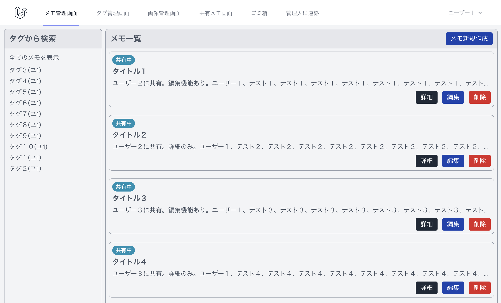
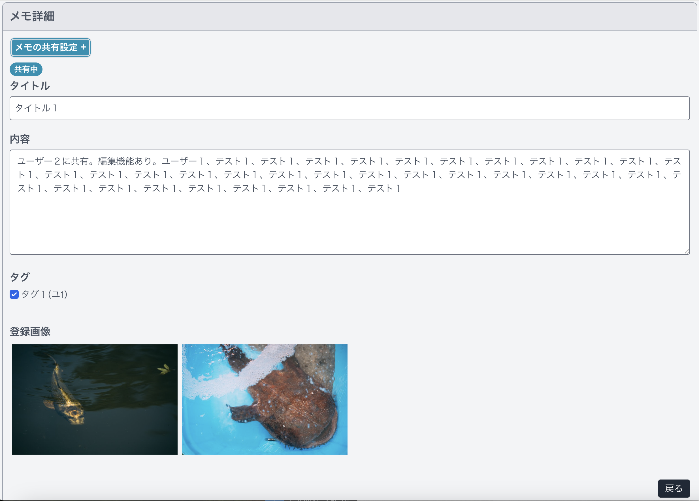

覚えておきたいことなどを、メモするサイトです。 
メモを画像付きで、保存、一部の人に共有できます。  
レスポンシブ対応しているのでスマホからもご確認いただけます。

### トップ画面

 

### 一覧画面

 

### 詳細画面

 

# 使用技術

- PHP 8.1
- Laravel 10
- Laravel/breeze 1.27
- Node.js 18.19.0
- npm 9.2.0
- Composer

- MySQL 5.7
- Apache 2.4.59
- phpMyAdmin

- JavaScript
- interventionImage
- micromodal
- tailwindcss
- vite

- AWS
    - VPC
    - EC2

- Docker/Docker-compose
- GitHub Actions
- PHPUnit

# AWS構成図

Dockerで、ローカル開発環境を整え、 
GitHubで、コード管理を行い、 
GitHub Actionsで、自動的にテストとデプロイを実行。 
本番環境は、AWSのEC2を利用しており、Laravelアプリケーションが、Apacheサーバー上で動作する形です。（Docker上）

# GitHub Actions CI/CD

- Githubへのdevelopブランチのマージ時に、テストを実行します。
- テストが成功した場合、EC2へのデプロイが自動で実行されます。

# 機能一覧

- ユーザー登録、ログイン機能（Laravel/breeze）
- メモ登録機能
    - タグ登録機能
    - 画像登録機能
    - リサイズ（interventionImage）
    - モーダルウィンドウ（micromodal）
    - 共有機能
- 管理人への問い合わせ機能
- 管理人ログイン機能（Laravel/breeze）
    - ユーザーの管理機能

- ページネーション機能
- 検索機能

# テスト

- PHPUnit
    - 単体テスト
    - 統合テスト
