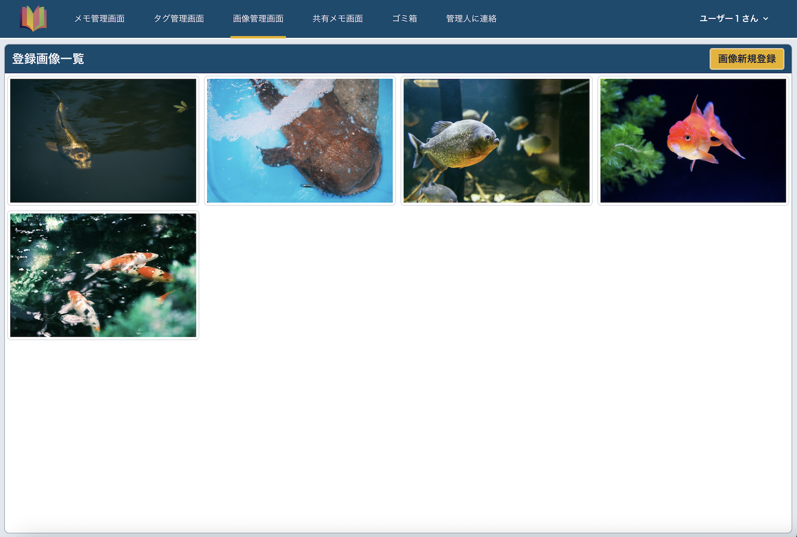
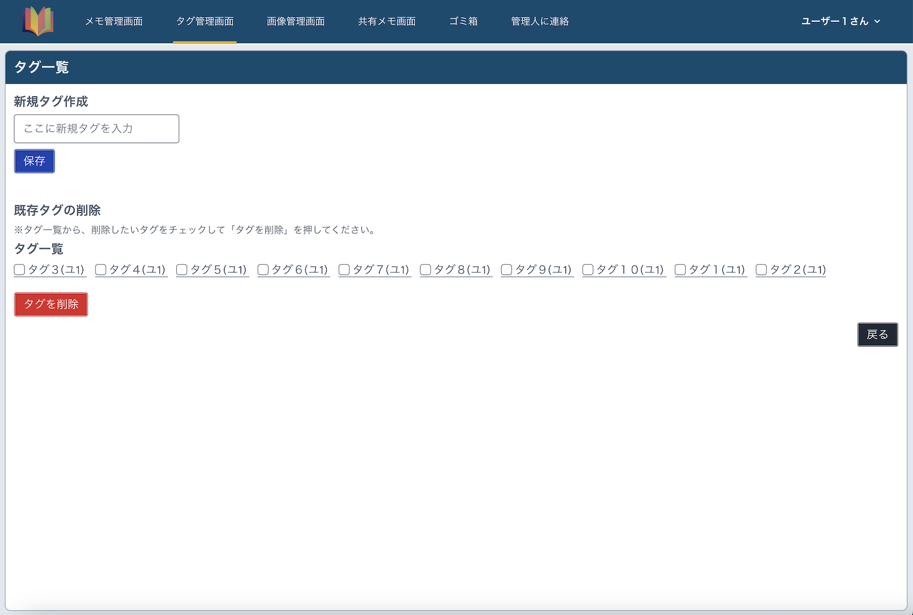
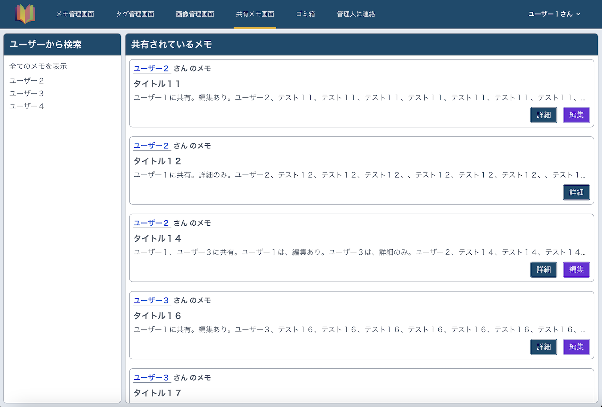
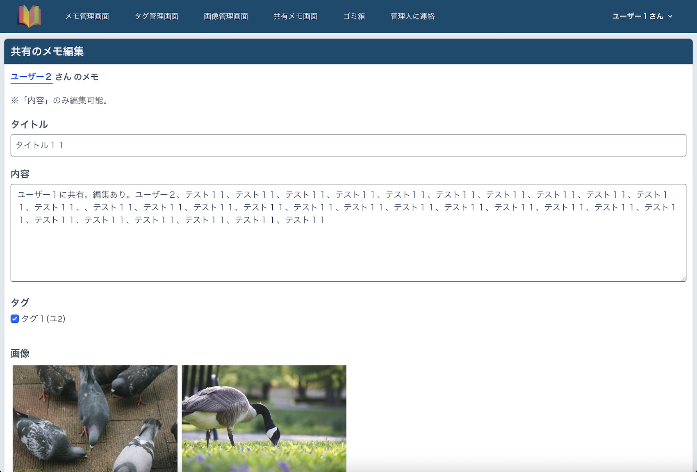
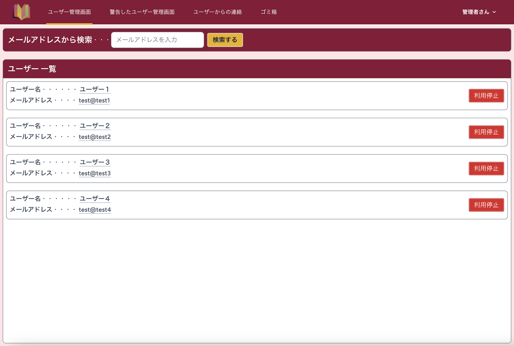
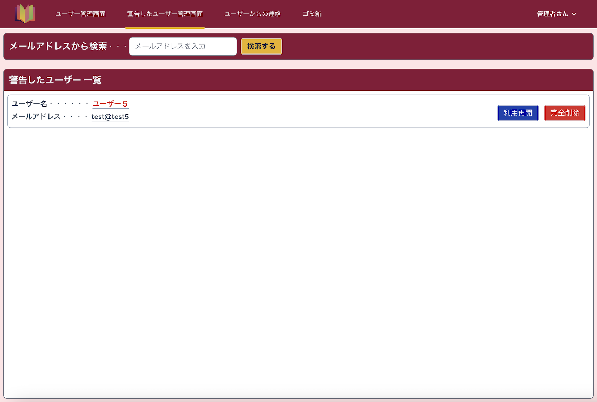

README.md

覚えておきたいことなどを、メモするサイトです。 
メモを画像付きで、保存、一部の人に共有できます。  
レスポンシブ対応しているのでスマホからもご確認いただけます。

# 使用技術

- PHP 8.1
- Laravel 10
- Laravel/breeze 1.27
- Node.js 18.19.0
- npm 9.2.0
- Composer

- MySQL 5.7
- Apache 2.4.59
- phpMyAdmin

- JavaScript
- interventionImage
- micromodal
- tailwindcss
- vite

- AWS
    - VPC
    - EC2

- Docker/Docker-compose
- GitHub Actions
- PHPUnit

# AWS構成図

Dockerで、ローカル開発環境を整え、 
GitHubで、コード管理を行い、 
GitHub Actionsで、自動的にテストとデプロイを実行。 
本番環境は、AWSのEC2を利用しており、Docker上で、Laravelアプリケーションが、Apacheサーバーで動作する形です。

# GitHub Actions CI/CD

- Githubへのdevelopブランチのマージ時に、テストを実行します。
- テストが成功した場合、EC2へのデプロイが自動で実行されます。

# 機能一覧

| ユーザー用トップ画面                                           | 　メモ一覧画面（ユーザー用）                                |
|------------------------------------------------------|-----------------------------------------------|
|          |  |
| ユーザー専用のトップ画面です。登録したログインIDとパスワードを入力することでログイン可能にしています。 | 保存されたメモの一覧から、詳細、編集、削除と、タグからメモの絞り込む機能を実装しました。  |

| 新規メモ作成画面（ユーザー用）                                     | 　新規メモ作成の画像の選択画面（ユーザー用）                                     |
|-----------------------------------------------------|------------------------------------------------------------|
|   |     |
| タイトル、内容、新規または登録済みのタグ、登録済み画像を、メモに付けて、新規店舗登録可能にしています。 | 新規メモ作成画面の、画像選択ボタンをクリックすることでモーダルが開き、登録済みの画像を選択できるように実装しました。 |

| メモの詳細画面（ユーザー用）                                  | 　メモの共有設定画面（ユーザー用）                                                              |
|-------------------------------------------------|--------------------------------------------------------------------------------|
|  |                            |
| 登録したメモの詳細を表示する機能を実装しました。            　　　         | メモ詳細画面の、メモ共有設定ボタンをクリックすることでアコーディオンが開き、メモの共有、編集の許可（テキストのみ）、共有状態を確認できるように実装しました。 |

| 画像一覧画面（ユーザー用）                                      | 　新規画像登録画面（ユーザー用）                                       |
|----------------------------------------------------|--------------------------------------------------------|
|  |    |
| メモに登録できる画像一覧、画像をクリックすると、画像の詳細、削除を可能にしています。         | 画像の一覧画面の、画像新規登録ボタンをクリックすることで、画像をリサイズして登録ができるように実装しました。 |

| タグ管理画面（ユーザー用）                                 | 　管理人への問い合わせ画面（ユーザー用）                                    |
|-----------------------------------------------|---------------------------------------------------------|
|  |  |
| メモに登録できるタグの一覧、新規作成、削除を可能にしています。               | 管理人へ連絡ができるように実装しました。                                    |

| 共有メモ一覧画面（ユーザー用）                                         | 　共有メモ編集画面（ユーザー用）                                       |
|---------------------------------------------------------|--------------------------------------------------------|
|  |  |
| 自分に共有されているメモ一覧から、詳細、編集と、ユーザー名から共有メモを絞り込みを可能にしています。      | 共有メモの編集が許可されている場合は、編集（内容のみ）できるように実装しました。               |

| 管理者用トップ画面                                              | 　ユーザー一覧画面（管理者用）                                                |
|--------------------------------------------------------|----------------------------------------------------------------|
|             |             |
| 管理者専用のトップ画面です。登録されているログインIDとパスワードを入力することでログイン可能にしています。 | 特定のユーザーのサービスの利用を一時的に停止する機能、メールアドレスから特定のユーザーを検索する機能を実装しました。 　　　 |

| 警告ユーザー一覧画面（管理者用）                                              | 　ユーザーからの問い合わせ画面（管理者用）                                       |
|---------------------------------------------------------------|-------------------------------------------------------------|
|  |  |
| 利用停止したユーザーの、サービスの再開、ユーザーの完全削除を可能にしています。                       | ユーザーからの問い合わせを確認。キーワードで、件名、問い合わせ内容の両方から検索する機能を実装しました。        |

- ログイン機能（Laravel/breeze）
- リサイズ（interventionImage）
- モーダルウィンドウ（micromodal）

# テスト

- PHPUnit
    - 単体テスト
    - 統合テスト